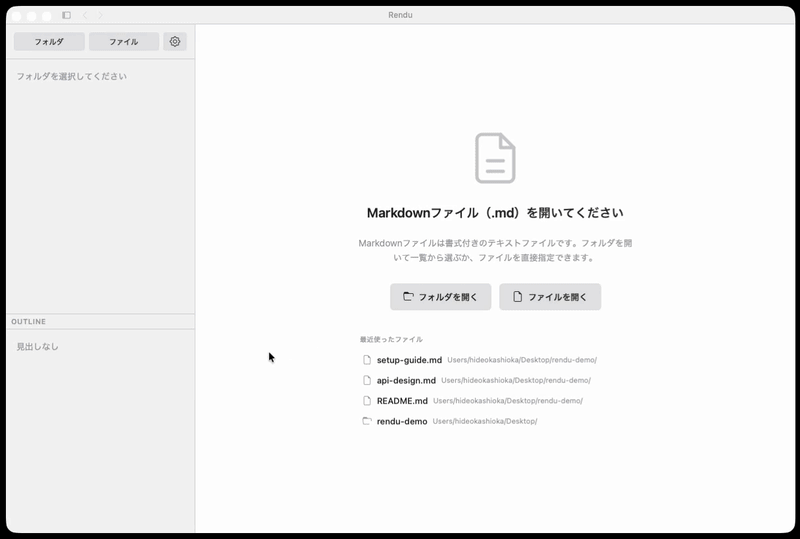
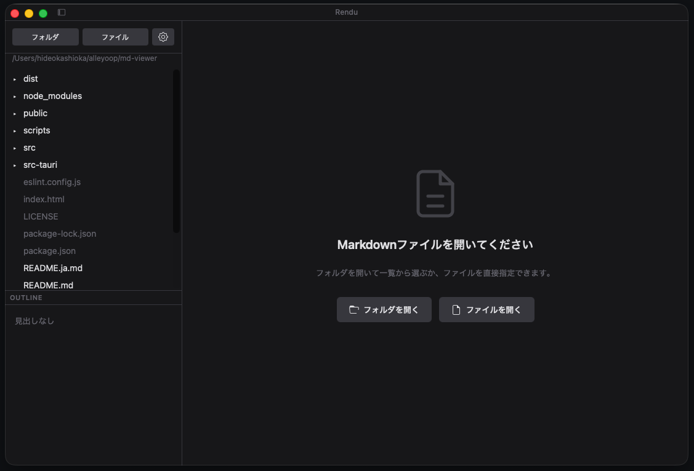
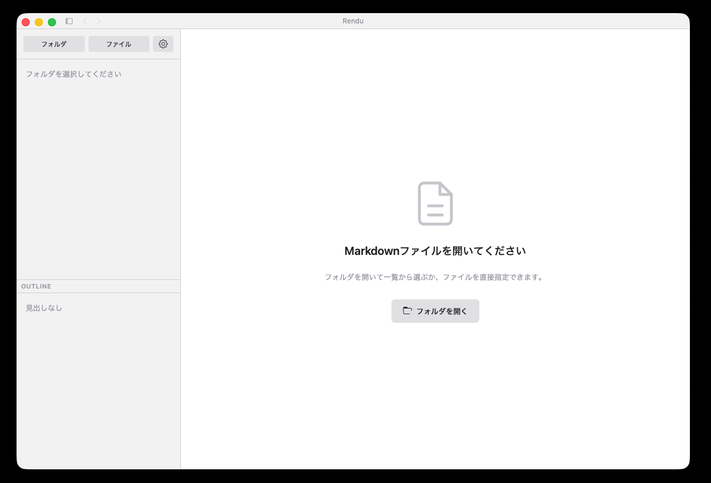
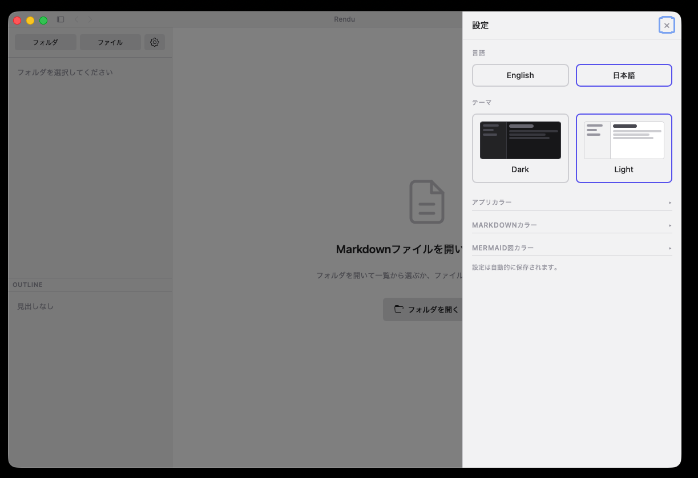
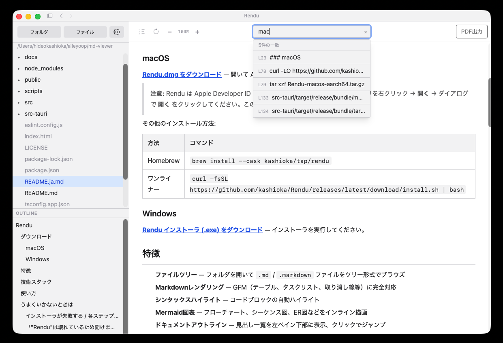

# Rendu

**Markdownという設計図を、美しい完成形として返す。**
ファイルをドラッグするだけで読める、無料の軽量リーダー。
設定不要、アカウント不要ですぐ使えます。

> *Rendu* はフランス語で「仕上げられたもの」「手渡されたもの」を意味する。建築家が設計の意図を伝えるために描く完成予想図（rendu）になぞらえ、マークダウンという設計図を、直感的に伝わる美しい形へ返すためのビューワー。

### なぜ Rendu？

| | Rendu | Obsidian | Typora | VS Code |
|---|:---:|:---:|:---:|:---:|
| 瞬時に起動 | **Yes** | 遅い | 普通 | 遅い |
| 設定不要 | **Yes** | プラグイン必須 | 少ない | 拡張機能必須 |
| 無料 | **Yes** | フリーミアム | 有料 | 無料 |
| 閲覧専用 | **Yes** | エディタ中心 | エディタ中心 | エディタ中心 |
| Mermaid 図表 | **Yes** | プラグイン | プラグイン | 拡張機能 |

### 「読む」に特化した設計

- **フォルダを開くだけですぐ見られる** — ファイルツリー・アウトライン・レンダリング結果を一画面に
- **Mermaid 図表・GFM テーブル・シンタックスハイライト** — すべて内蔵、追加インストール不要
- **ワンクリックで PDF 出力** — レンダリング結果をそのまま共有
- **軽量＆ネイティブ** — Tauri + Rust バックエンド、ディスク使用量 15 MB 以下
- **CLI 対応** — `rendu file.md` で即座に開いてレンダリング（macOS、Homebrew 経由）

**[English](./README.md)**






  

## ダウンロード

### macOS

**[Rendu.dmg をダウンロード](https://github.com/kashioka/Rendu/releases/latest/download/Rendu_0.5.1_aarch64.dmg)** — 開いて Applications にドラッグしてください。

> Rendu はAppleによるコード署名・公証済みです。DMGを開いてApplicationsにドラッグするだけで、すぐに使えます。

その他のインストール方法:

| 方法 | コマンド |
|------|---------|
| Homebrew | `brew install --cask kashioka/tap/rendu` |
| CLI | Homebrew インストール後: `rendu README.md` |

### Windows

**[Rendu インストーラ (.exe) をダウンロード](https://github.com/kashioka/Rendu/releases/latest)** — インストーラを実行してください。

## 特徴

- **ファイルツリー** — フォルダを開いて `.md` / `.markdown` ファイルをツリー形式でブラウズ
- **Markdownレンダリング** — GFM（テーブル、タスクリスト、取り消し線等）に完全対応
- **シンタックスハイライト** — コードブロックの自動ハイライト
- **Mermaid図表** — フローチャート、シーケンス図、ER図などをインライン描画
- **ドキュメントアウトライン** — 見出し一覧を左ペイン下部に表示、クリックでジャンプ
- **PDF出力** — 表示中のMarkdownをA4サイズのPDFとしてエクスポート
- **テーマカスタマイズ** — 背景色・文字色・コードブロック色などをリアルタイムに変更
- **リサイザブルUI** — ファイルツリーとアウトラインの境界をドラッグで調整可能

## 技術スタック

| レイヤー | 技術 |
|---------|------|
| デスクトップFW | Tauri 2.0 (Rust) |
| フロントエンド | React 19 + TypeScript + Vite |
| MDレンダリング | react-markdown + remark-gfm + rehype-highlight |
| 図表 | Mermaid |
| PDF出力 | html2pdf.js |
| スタイリング | Tailwind CSS 4 |

## 使い方

**ターミナルから:**

```bash
rendu README.md
```

**アプリから:**

1. アプリを起動
2. **フォルダを開く** からMarkdownファイルがあるフォルダを選択、または **ファイルを開く** から単一ファイルを開く
3. 右パネルにレンダリング結果が表示される
4. 左ペイン下部の **Outline** で見出し一覧を確認、クリックでジャンプ
5. 上部の **PDF Export** ボタンでPDFに出力
6. 歯車アイコンからテーマカスタマイズ

## うまくいかないときは

### インストーラが失敗する / 各ステップを自分で確認したい

手動でダウンロード・インストールする手順:

```bash
curl -LO https://github.com/kashioka/Rendu/releases/latest/download/Rendu-macos-aarch64.tar.gz
tar xzf Rendu-macos-aarch64.tar.gz
mv Rendu.app /Applications/
open /Applications/Rendu.app
```

すべてのバージョンとリリースノートは [Releases](https://github.com/kashioka/Rendu/releases) ページから確認できます。

## 開発者向け

Rendu をローカルで開発・ビルドしたい開発者・コントリビューター向けの手順です。

**前提条件**

- [Node.js](https://nodejs.org/) 18+
- [Rust](https://rustup.rs/)
- Xcode Command Line Tools (`xcode-select --install`)

**リポジトリを取得して依存関係をインストール**

```bash
git clone https://github.com/kashioka/Rendu.git
cd Rendu
npm install
```

**開発モードで起動**

```bash
npm run dev
```

**リリースビルド**

```bash
npm run build
./scripts/build-tarball.sh
```

生成される成果物:

```
src-tauri/target/release/bundle/macos/Rendu.app
src-tauri/target/release/bundle/tarball/Rendu-macos-aarch64.tar.gz
```

## プロジェクト構成

```
Rendu/
├── src/
│   ├── components/
│   │   ├── FileTree.tsx        # ファイルツリーブラウザ
│   │   ├── MarkdownViewer.tsx  # Markdownレンダリング + PDF出力
│   │   ├── MermaidBlock.tsx    # Mermaid図表レンダリング
│   │   ├── OutlinePanel.tsx    # ドキュメントアウトライン
│   │   └── Settings.tsx        # テーマ設定パネル
│   ├── App.tsx                 # メインレイアウト
│   ├── main.tsx                # エントリポイント
│   ├── useSettings.ts          # テーマ設定hooks
│   └── index.css               # グローバルスタイル
├── src-tauri/
│   ├── src/                    # Rustバックエンド
│   ├── capabilities/           # Tauri権限設定
│   └── tauri.conf.json         # Tauri設定
└── package.json
```

## フィードバック

不具合報告や機能要望は [Issues](https://github.com/kashioka/Rendu/issues) からお願いします。

## ライセンス

MIT
